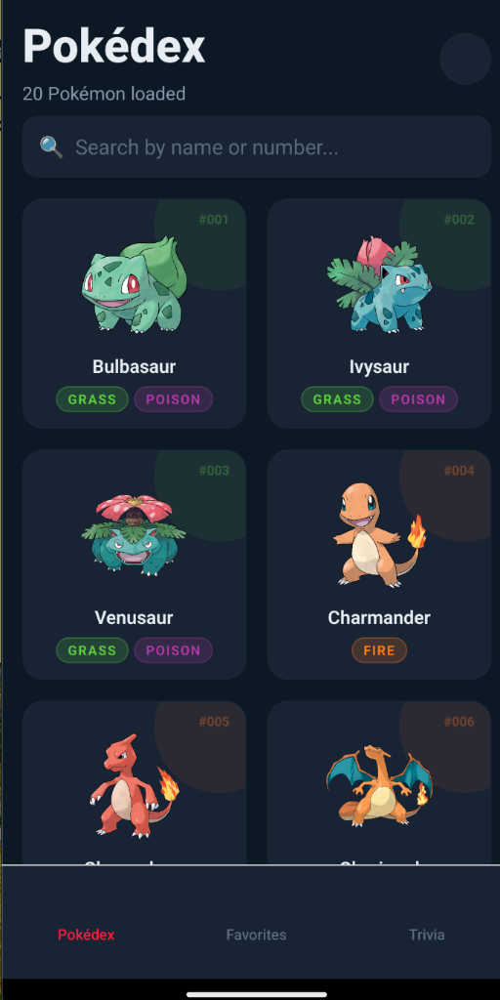
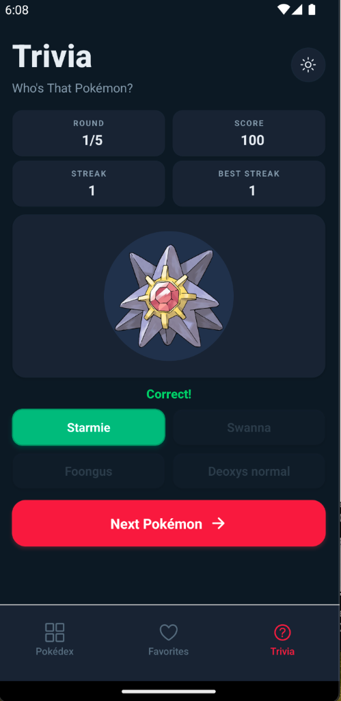
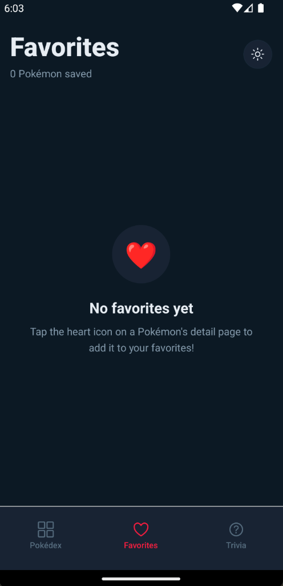
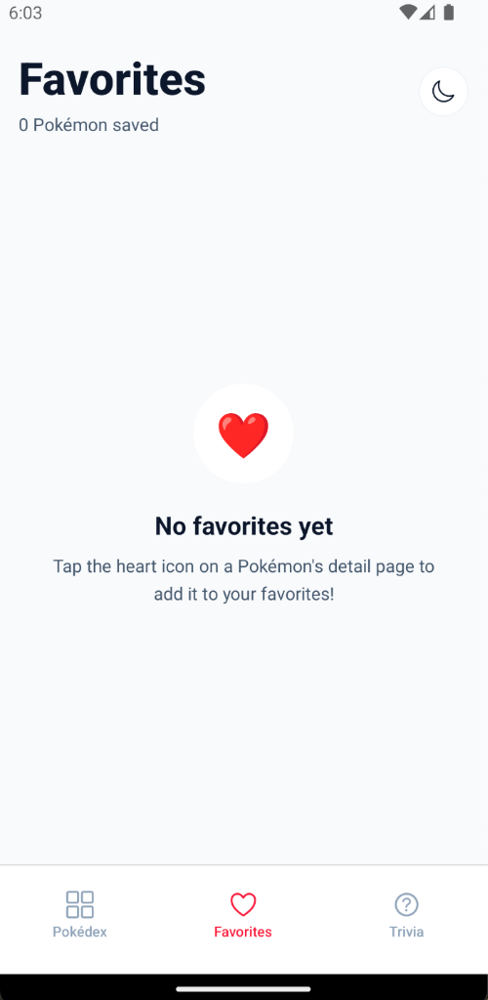
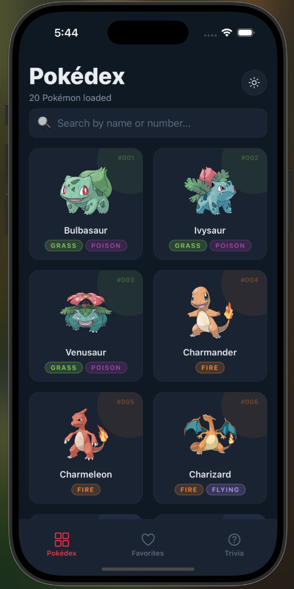
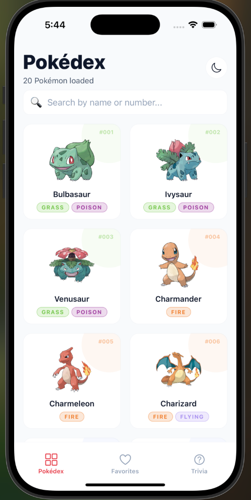
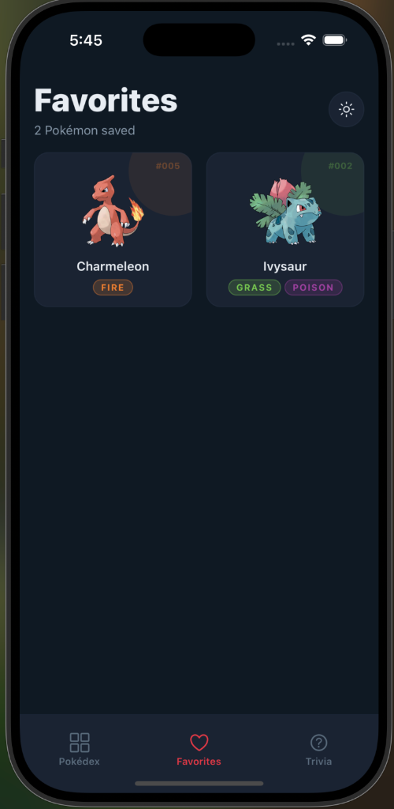
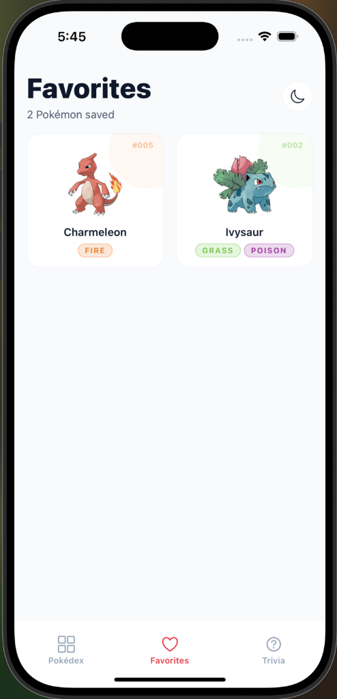
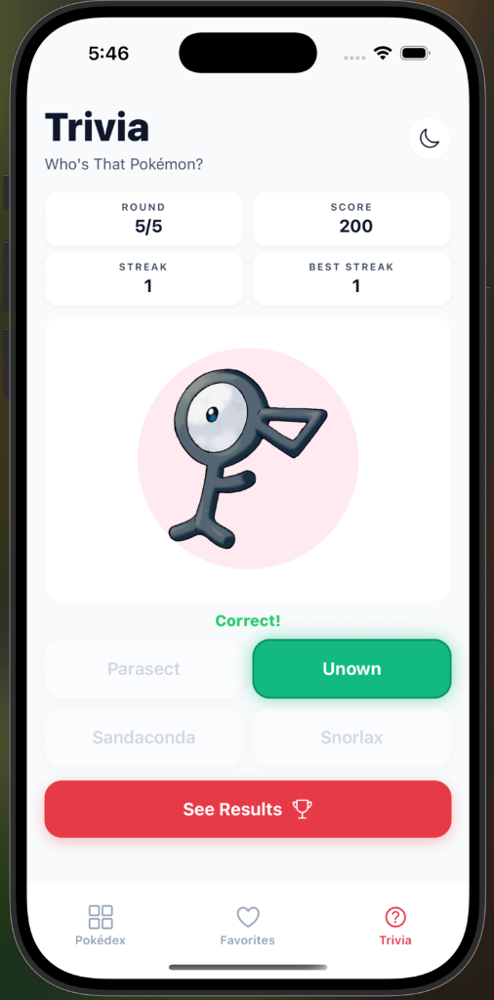

# 🔴 Pokédex — React Native Expo App

A premium dark-themed Pokédex app built with **Expo + TypeScript** that fetches and displays Pokémon data from PokéAPI.

## 📱 UI/UX Showcase

### 🤖 Android Screenshots

| Pokédex (Dark) | Trivia Game (Dark) | Favorites (Dark) | Favorites (Light) |
| :---: | :---: | :---: | :---: |
|  |  |  |  |

### 🍎 iOS Screenshots

| Pokédex (Dark) | Pokédex (Light) | Favorites (Dark) | Favorites (Light) | Trivia (Light) |
| :---: | :---: | :---: | :---: | :---: |
|  |  |  |  |  |

## 🎯 API Choice

**[PokéAPI](https://pokeapi.co/)** — A free, open RESTful API for Pokémon data. No API key required.

- **Base URL:** `https://pokeapi.co/api/v2/`
- **Endpoints used:**
  - `/pokemon?limit=20&offset=0` — Paginated Pokémon list
  - `/pokemon/{id}` — Full Pokémon detail (sprites, stats, types, abilities)
  - `/pokemon-species/{id}` — Flavor text descriptions

## 🚀 Setup Instructions

### Prerequisites

- **Node.js**: 18+ installed
- **For iOS (macOS only)**: Xcode installed (for iOS simulator)
- **For Android**: Android Studio, Android SDK, and an Android Virtual Device (AVD) configured

### Installation

```bash
# Clone the repository
git clone <repo-url>
cd pokedex-app

# Install dependencies
npm install
```

### Running the App

```bash
# Run on iOS simulator (native build via Xcode, macOS only)
npx expo run:ios

# Run on Android emulator or connected device (native build via Android Studio SDK)
npx expo run:android
```

> **Note:** This app uses a native build workflow (`npx expo run:ios` / `npx expo run:android`) to support high-performance native modules — not Expo Go.

## 📱 Features

### Core
- ✅ Fetch Pokémon data on mount with infinite scroll pagination
- ✅ Vertical scrollable screens (supports click and drag scroll on simulators and touch drag on devices)
- ✅ Display Pokémon in a beautiful 2-column grid
- ✅ Handle loading states with animated skeleton placeholders
- ✅ Handle errors gracefully with retry functionality
- ✅ Pull-to-refresh support

### Navigation (Expo Router)
- ✅ Bottom tab navigation (Pokédex + Favorites)
- ✅ Stack navigation for detail screen (slide-up animation)
- ✅ Deep linking support via Expo Router

### State Management (React Context)
- ✅ Favorites system with `useFavorites()` hook
- ✅ Persisted to AsyncStorage (survives app restarts)

### Premium UI
- ✅ Dark theme with Pokémon-type-colored accents
- ✅ Animated stat bars (react-native-reanimated)
- ✅ Press scale animations on cards
- ✅ Shimmer loading skeletons
- ✅ Type-colored badges
- ✅ Hero sprite with gradient background on detail screen
- ✅ Search/filter by name or Pokédex number

## 🏗 Architecture

```
src/
├── api/              # API layer (fetch functions + helpers)
├── app/              # Expo Router screens
│   ├── (tabs)/       # Tab navigator (Home + Favorites)
│   └── pokemon/      # Detail screen ([id].tsx)
├── components/       # Reusable UI components
├── constants/        # Theme (colors, typography, spacing)
├── context/          # React Context (FavoritesProvider)
├── hooks/            # Custom hooks (usePokemonList, usePokemonDetail)
└── types/            # TypeScript interfaces
```

## 🛠 Tech Stack

| Tool | Purpose |
|------|---------|
| Expo SDK 56 | Framework |
| TypeScript | Language |
| Expo Router | File-based navigation |
| React Native Reanimated | Animations |
| expo-image | Optimized image loading |
| AsyncStorage | Persistent storage |
| PokéAPI | Data source |
